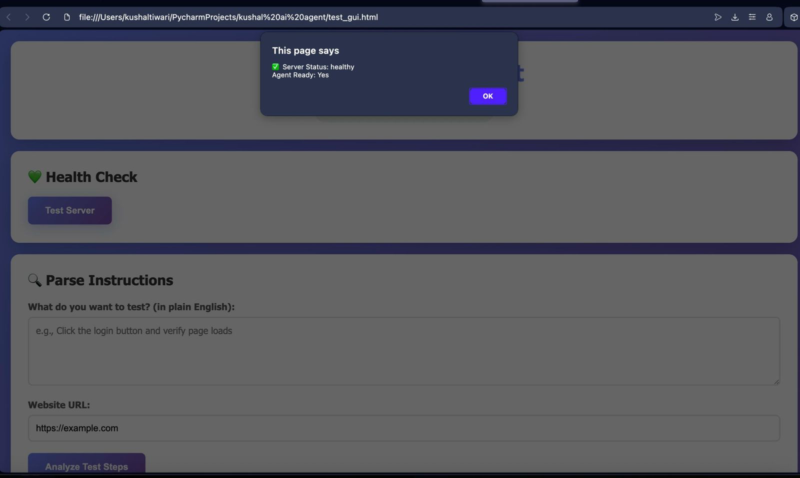
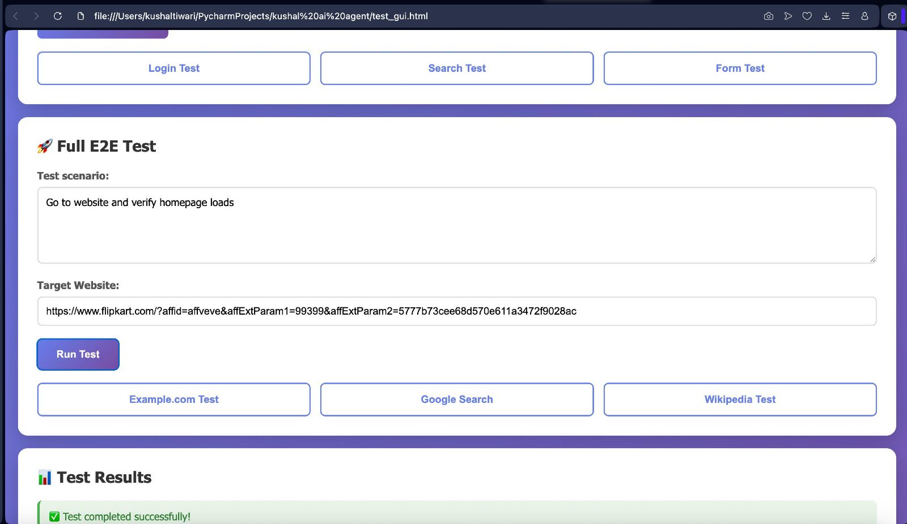
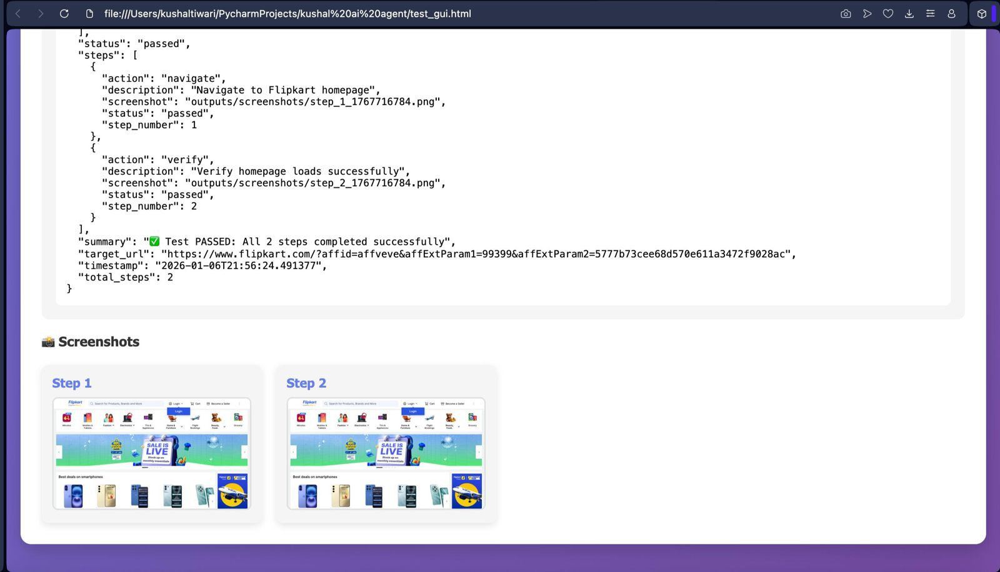
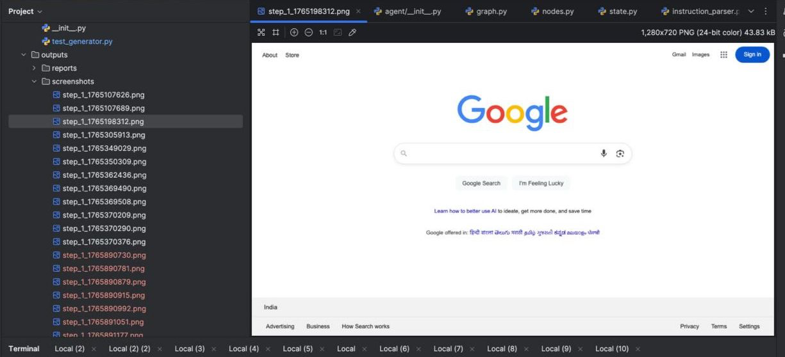
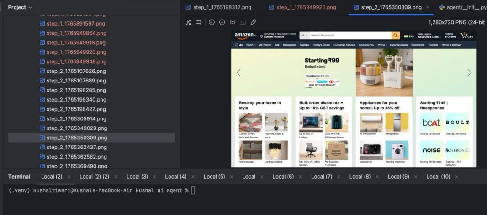
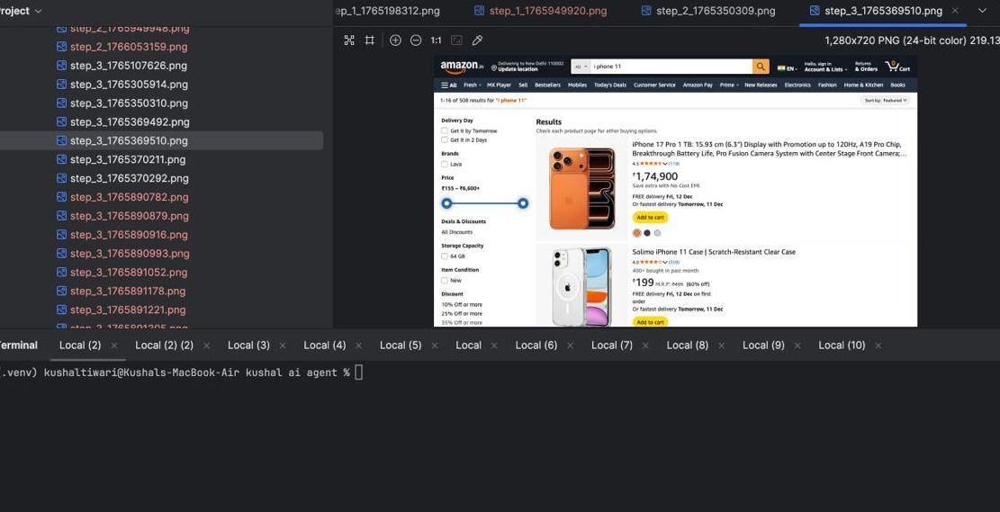
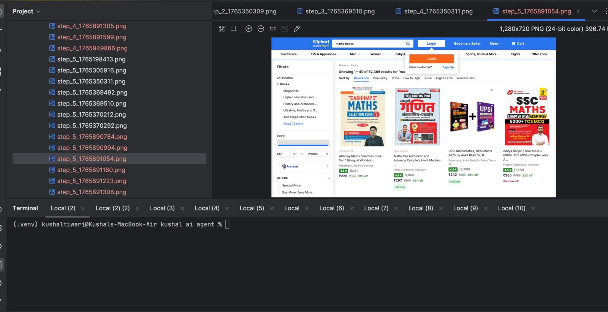
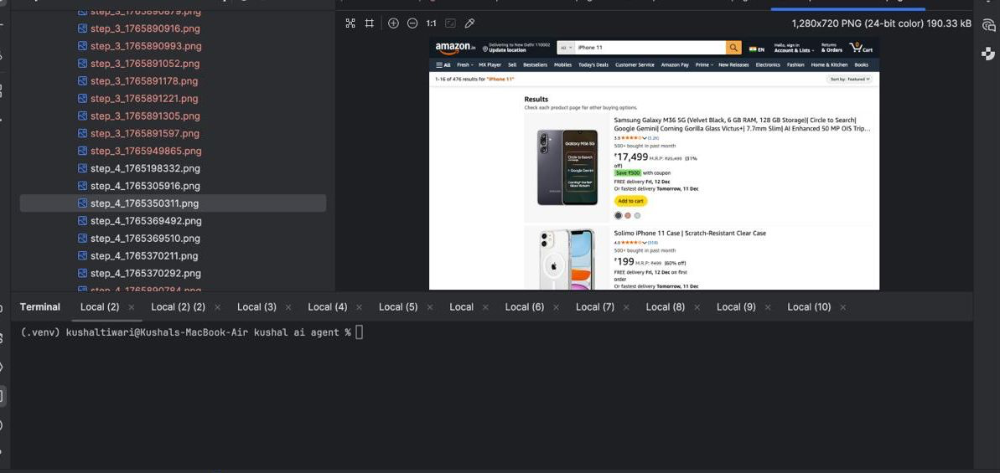

# Milestone 3 Report

## What I Built
- Test Generator: Generates Playwright code from test steps
- Test Executor: Runs the tests and captures screenshots
- Integration Test: Tests the complete workflow

## Files Created
1. `generators/test_generator.py` - Generates test code
2. `executors/test_executor.py` - Executes tests
3. `test_integration.py` - Integration test

## Test Results

## Screenshots Generated

## Status
✅ Milestone 3 Complete

- Code generation working
- Test execution working
- Screenshots captured
- Reports generated
