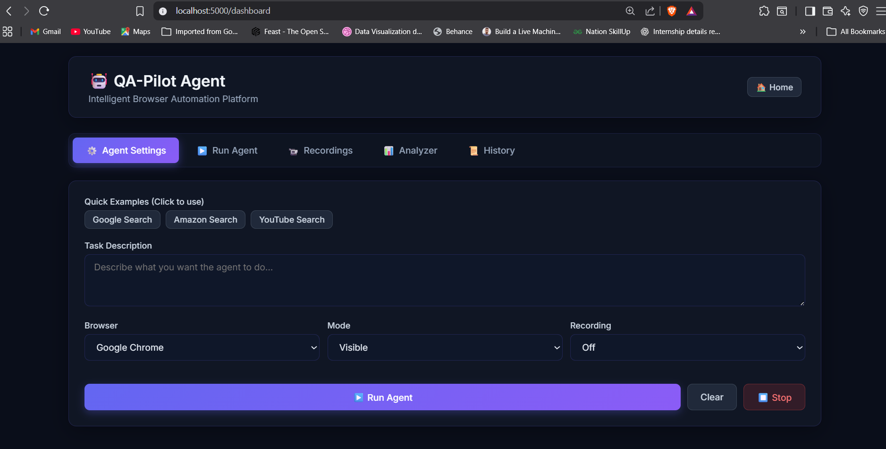

<div align="center">

# 🤖 QA-Pilot Agent

### *Intelligent Browser Automation Platform*

[](https://www.python.org/downloads/)
[](https://flask.palletsprojects.com/)
[](https://playwright.dev/)
[](https://opensource.org/licenses/MIT)

**Test websites automatically using natural language - No coding required!**

[🚀 Quick Start](#-quick-start) • [✨ Features](#-key-features) • [📸 Screenshots](#-screenshots) • [🛠️ Installation](#%EF%B8%8F-installation) • [📚 Documentation](#-documentation)

---

</div>

## 📖 Overview

**QA-Pilot Agent** is a revolutionary AI-powered testing platform that converts plain English instructions into automated browser tests. Simply describe what you want to test, and watch the agent execute it flawlessly using Playwright automation.

> **Example:** Type *"Go to youtube.com and search for 'AI tutorial'"* → The agent automatically navigates, interacts with elements, and generates a comprehensive test report!

### 🎯 Why QA-Pilot Agent?

- ⚡ **Zero Code** - No programming knowledge needed
- 🎨 **Beautiful UI** - Modern dashboard with real-time process visualization
- 🧠 **Smart Parsing** - Advanced natural language understanding
- 📊 **Rich Reports** - PDF, HTML, and JSON export formats
- 📹 **Session Recording** - Capture and replay test executions
- 🌐 **Multi-Browser** - Chrome, Firefox, Edge support

---

## ✨ Key Features

### 🗣️ Natural Language Testing
Write test cases in plain English. Our intelligent parser understands actions like:
- Navigate, Go to, Open
- Click, Type, Fill, Enter
- Search, Select, Scroll
- Wait, Check, Verify

### 📹 Session Recording
- Automatic event capture with timestamps
- Screenshot collection at key moments
- Downloadable JSON recordings
- Complete test session playback

### 📊 Multi-Format Reports
Generate professional reports in multiple formats:
- **PDF** - Beautiful formatted reports with branding
- **HTML** - Interactive reports with charts
- **JSON** - Machine-readable data for CI/CD

### 🎨 Modern Dashboard
- Real-time 5-step process animation
- Live test execution monitoring
- Beautiful gradient UI with smooth transitions
- Responsive design for all devices

### 🔧 Advanced Features
- Multiple browser support (Chromium, Firefox, Edge)
- Headless & visible execution modes
- Full-page screenshot capture
- Test history tracking
- Quick example templates
- One-click report downloads

---

## 📸 Screenshots

### Landing Page
> *Add your landing page screenshot here*


### Agent Settings Tab
> *Configure your test parameters*



### Run Agent Tab - Results
> *View execution steps and Playwright code*


### Analyzer Tab
> *Generate and download reports*


---

## 🛠️ Installation

### Prerequisites

- **Python 3.8+** (Python 3.14 recommended)
- **pip** package manager
- **Git** for version control
- Internet connection for browser downloads

### Step 1: Clone Repository

```bash
git clone <your-repository-url>
cd AI-Agent-for-Automated-Website-Testing
```

### Step 2: Install Dependencies

**Windows (PowerShell):**
```powershell
python -m pip install --upgrade pip
pip install -r requirements.txt
playwright install chromium
```

**Linux/Mac:**
```bash
python3 -m pip install --upgrade pip
pip3 install -r requirements.txt
playwright install chromium
```

### Step 3: Set Up Environment (Optional)

Create a `.env` file for API keys:
```env
GEMINI_API_KEY=your_api_key_here  # Optional - for enhanced parsing
```

### Step 4: Run the Application

```bash
python app.py
```

The application will start at: **http://localhost:5000**

---

## 🚀 Quick Start

### Running Your First Test

1. **Open the Dashboard**
   - Navigate to `http://localhost:5000`
   - Click **"Start Testing Now"** or **"Dashboard"**

2. **Configure Test Settings** (Agent Settings Tab)
   - Enter task description: *"Go to google.com and search for 'Playwright'"*
   - Select browser: Chrome/Firefox/Edge
   - Choose mode: Visible or Headless
   - Enable/disable recording

3. **Run the Test**
   - Click **"▶️ Run Agent"**
   - Watch the 5-step process animation
   - Results automatically appear in **Run Agent** tab

4. **View Results**
   - ✅ Test status (Passed/Failed)
   - 📋 Execution steps with screenshots
   - 💻 Generated Playwright code
   - 📥 Download reports (PDF/HTML/JSON)

---

## 📚 Documentation

### Project Structure

```
├── 📁 agent/                    # Core agent modules
│   ├── code_generator.py        # Playwright code generation
│   ├── executor.py              # Test execution engine
│   ├── parser.py                # Natural language parser
│   ├── recording_manager.py    # Session recording
│   └── report_analyzer.py      # Report generation
├── 📁 static/                   # Frontend assets
│   ├── css/                     # Stylesheets
│   ├── js/                      # JavaScript files
│   └── screenshots/             # Generated screenshots
├── 📁 templates/                # HTML templates
│   ├── dashboard_modern.html   # Main dashboard
│   └── index.html              # Landing page
├── 📁 reports/                  # Generated test reports
├── 📁 recordings/               # Test session recordings
├── 📄 app.py                    # Main Flask application
├── 📄 requirements.txt          # Python dependencies
├── 📄 QUICKSTART.md            # Quick start guide
└── 📄 README.md                # This file
```

### API Endpoints

| Endpoint | Method | Description |
|----------|--------|-------------|
| `/` | GET | Landing page |
| `/dashboard` | GET | Main dashboard |
| `/api/test` | POST | Execute test |
| `/api/recordings` | GET | List recordings |
| `/api/recordings/<id>/download` | GET | Download recording |
| `/api/analyzer/generate` | POST | Generate report |
| `/api/analyzer/reports` | GET | List reports |
| `/api/analyzer/download/<id>/<format>` | GET | Download report |
| `/api/export/pdf` | POST | Export PDF report |

---

## 🎯 Usage Examples

### Example 1: Google Search Test
```
Task: Go to google.com and search for 'OpenAI'
Browser: Chrome
Mode: Visible
```

### Example 2: E-commerce Navigation
```
Task: Navigate to amazon.com, search for 'laptop', wait 3 seconds
Browser: Firefox
Mode: Headless
```

### Example 3: Video Search
```
Task: Open youtube.com, type 'Python tutorial' in search box
Browser: Edge
Mode: Visible
Recording: On
```

---

## 🔧 Configuration

### Browser Options
- **chromium** - Google Chrome (default)
- **firefox** - Mozilla Firefox
- **msedge** - Microsoft Edge

### Execution Modes
- **Visible** - Watch browser actions in real-time
- **Headless** - Run tests silently in background (faster)

### Recording Options
- **On** - Capture all events and screenshots
- **Off** - Skip recording (faster execution)

---

## 📦 Dependencies

Core libraries used in this project:

```txt
flask==3.0.0              # Web framework
playwright==1.40.0        # Browser automation
langchain==0.1.0          # AI parsing (optional)
langgraph==0.2.27         # Workflow orchestration
fpdf2==2.8.5              # PDF generation
colorama==0.4.6           # Terminal colors
python-dotenv==1.0.0      # Environment variables
flask-cors==4.0.0         # CORS support
```

---

## 🚦 Troubleshooting

### Common Issues

**Issue: Browser not found**
```bash
# Solution: Install browsers
playwright install chromium firefox msedge
```

**Issue: Port 5000 already in use**
```bash
# Solution: Change port in app.py
app.run(debug=True, port=8080, host='0.0.0.0')
```

**Issue: Module not found errors**
```bash
# Solution: Reinstall dependencies
pip install -r requirements.txt --upgrade
```

---

## 🌟 Features Roadmap

- [x] Natural language parsing
- [x] Multi-browser support
- [x] Session recording
- [x] Multi-format reports
- [x] Process visualization
- [ ] CI/CD integration
- [ ] Parallel test execution
- [ ] Test scheduling
- [ ] Cloud deployment
- [ ] API authentication

---

## 🤝 Contributing

Contributions are welcome! Please follow these steps:

1. Fork the repository
2. Create a feature branch (`git checkout -b feature/AmazingFeature`)
3. Commit your changes (`git commit -m 'Add AmazingFeature'`)
4. Push to the branch (`git push origin feature/AmazingFeature`)
5. Open a Pull Request

---

## 📄 License

This project is licensed under the **MIT License** - see the [LICENSE](LICENSE) file for details.

---

## 👨‍💻 Author

**Yashaswini**

- GitHub: [@yashaswini](https://github.com/yashaswini)
- Project: QA-Pilot Agent

---

## 🙏 Acknowledgments

- [Playwright](https://playwright.dev/) - Browser automation framework
- [Flask](https://flask.palletsprojects.com/) - Web framework
- [LangChain](https://www.langchain.com/) - AI orchestration
- [FPDF2](https://pyfpdf.github.io/fpdf2/) - PDF generation

---

<div align="center">

### ⭐ Star this repository if you find it helpful!

**Made with ❤️ by Yashaswini**

[⬆ Back to Top](#-qa-pilot-agent)

</div>
