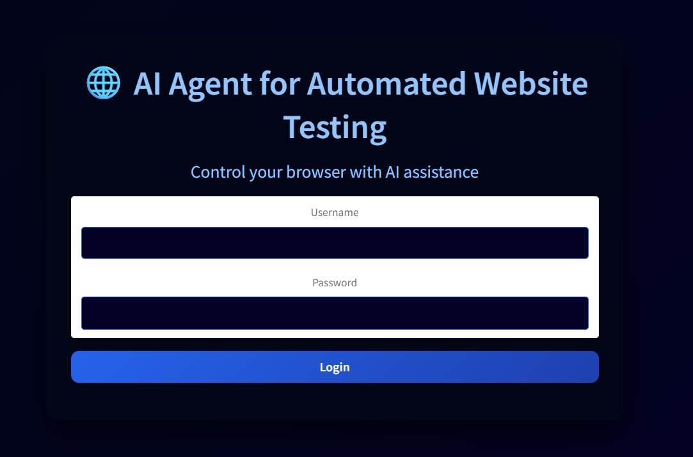
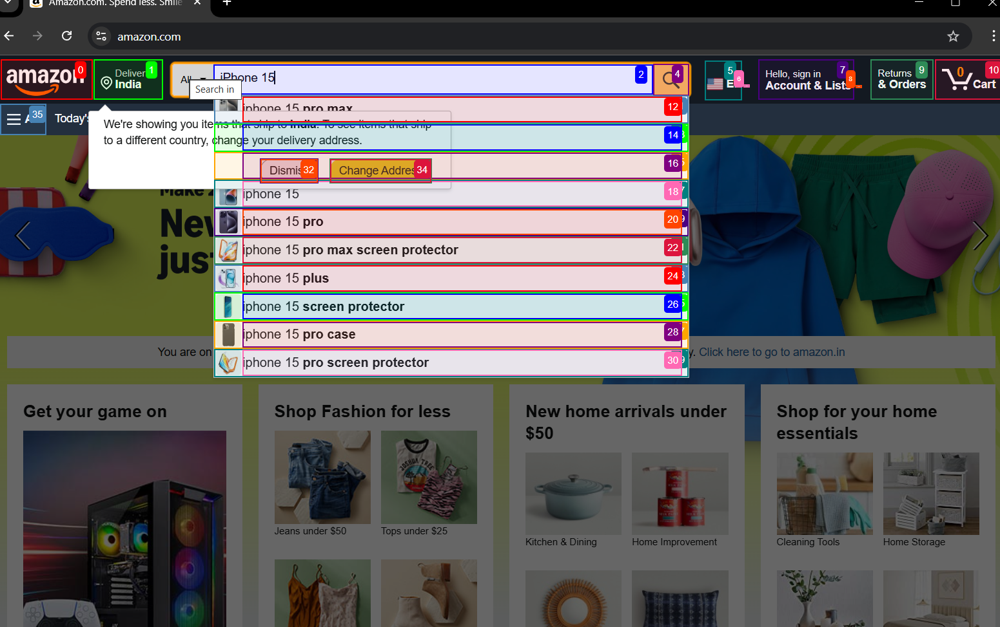

# 🌐 AI Agent for Automated Website Testing 
### WebQA Agent 

---

## 🚀 Project Overview

**WebQA Agent** is an AI-powered system for automated website testing using natural language instructions.

It provides an interactive and user-friendly **Web UI** built on top of the **browser-use framework**, enabling AI agents to interact with real websites through a graphical interface. This makes browser automation **accessible, observable, and easy to control**.

The Web UI supports multiple **Large Language Models (LLMs)**, persistent browser sessions, custom browser integration, and automated web interaction workflows.

---

## 🎯 Objectives Achieved

- ✅ Integrated **browser-use** with a **Gradio Web UI**
- ✅ Enabled **natural language instructions** for website testing
- ✅ Connected **LLMs** to browser automation workflows
- ✅ Implemented **persistent browser sessions**
- ✅ Supported **custom browser usage** with user profiles
- ✅ Displayed **real-time browser interaction results**

---

## 🧩 Project Description

**WebQA Agent** allows users to test websites by simply describing actions in plain English.

The system leverages:  

- **browser-use** for AI browser control  
- **Playwright** for browser automation  
- **Gradio** for Web UI interaction  
- **LLMs** for instruction understanding and action planning  

---

## 🚀 Key Features 

### 🖥️ Web UI Interface
- Gradio-based user interface for entering test instructions  

### 🤖 LLM-Powered Instruction Handling
- Converts natural language into executable browser actions  

### 🌐 Automated Website Interaction
- Navigation, clicks, form interactions, and UI validation  

### ♻️ Persistent Browser Sessions
- Browser state is preserved across tasks  

### 🌍 Custom Browser Support
- Uses existing browser profiles to avoid repeated logins  

### 🧠 Instruction Parsing & Code Generation
- Converts natural language instructions into structured actions  
- Generates Playwright scripts automatically using LangGraph  

### 📊 Real-time Reporting
- Shows live execution results in the Web UI  
- Provides metrics like page load time, number of executed actions  

---

## 🛠️ Technology Stack

### 🔹 Backend & AI
- **Python 3.11**  
- **browser-use**  
- **Playwright**  
- **LLMs** (OpenAI, Azure OpenAI, Ollama, DeepSeek)  
- **LangGraph** for workflow orchestration  

### 🔹 Frontend
- **Gradio Web UI**  
- **HTML5 / CSS / JavaScript**  
- **Font Awesome** icons  

---

## 📂 Project Structure

```
web-ui/
│
├── .github/                # GitHub workflows and issue templates
├── .venv/                  # Python virtual environment
├── .vscode/                # VS Code editor settings
│
├── assets/                 # Images and static assets
├── src/                    # Core source code
├── tests/                  # Test cases
├── tmp/                    # Temporary runtime files
│
├── .dockerignore
├── .env
├── .env.example
├── .gitignore
│
├── docker-compose.yml
├── Dockerfile
│
├── LICENSE
├── README.md
├── requirements.txt
├── SECURITY.md
├── supervisord.conf
└── webui.py               

```
---
##⚙️ Installation & Setup
---
### 1️⃣ **Clone the Repository**
```
git clone https://github.com/springboardmentor1029a-source/AI-Agent-for-Automated-Website-Testing.git
cd AI-Agent-for-Automated-Website-Testing
```

### 2️⃣ **Create Virtual Environment**
```
uv venv --python 3.11
```
Activate:

### Windows
```
.\.venv\Scripts\Activate.ps1
```
### macOS / Linux
```
source .venv/bin/activate
```
## 3️⃣ **Install Dependencies**
```
python -m venv venv
pip install -r requirements.txt

```
## 4️⃣ **Configure Environment**
```
cp .env.example .env

```
**(Add API keys if required)**

## 🚀 **Running the Application**
```
python webui.py --ip 127.0.0.1 --port 7788
```
**Open in browser:**
```
http://127.0.0.1:7788
```
## 💡 **Usage Examples**

**“Open Amazon and search for iPhone 15”**

**“Navigate to the contact page and verify the form is visible”**

**“Check all links and images on the homepage”**

## 📸 **Screenshots**

Add screenshots in assets/screenshots/
## 📸 **Screenshots**

### 🔐 Login Page


### 📘 Agent Search Page


### 🤖 AI Browser Agent


## 📊 **Project Outcome**

**Successfully demonstrated AI-controlled browser testing**

**Verified Web UI → Agent → Browser execution flow**

**Built a strong foundation for advanced testing features in future milestones**

## 📝 License

**This project is developed for educational and internship purposes.**
