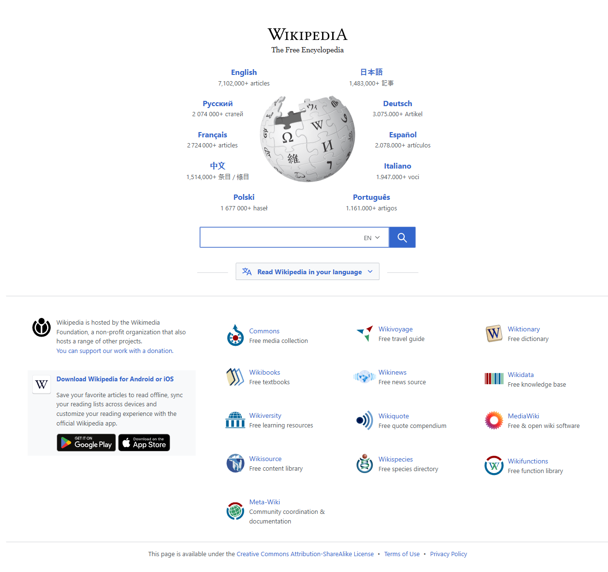

# 🤖 AI Web Testing Agent

An AI-powered web testing tool that allows users to **test websites using natural language instructions**.  
The system automatically opens the website, performs actions, captures **screenshots**, records **videos**, and generates **test reports**, all viewable through a modern dashboard UI.

---

## 🚀 Features

- 🧠 **Natural Language Test Instructions**
  - Example: *"Open Myntra and search for shoes"*

- 🌐 **Automated Website Interaction**
  - Uses browser automation to execute user instructions

- 📸 **Automatic Screenshot Capture**
  - Captures the final state of the webpage after execution

- 🎥 **Video Recording of Test Execution**
  - Records the full test flow for review

- 📊 **Interactive Dashboard**
  - Test statistics (Total / Passed / Failed)
  - Progress bar
  - Recent test executions
  - Failure summary
  - Latest report link

- 💾 **State Persistence**
  - Last test result is preserved even after refresh or navigation

- 🕒 **Test History Tracking**
  - Click any past test to re-run it instantly

- 📄 **Auto-generated HTML Reports**

---

## 🛠 Tech Stack

### Frontend
- HTML
- CSS
- JavaScript (Vanilla)

### Backend
- Python
- Flask
- Playwright (Browser Automation)

---

## 📂 Project Structure

ai-web-testing-agent/
│
├── backend/
│   ├── app.py
│   ├── agent.py
│   ├── executor.py
│   ├── generator.py
│   ├── parser.py
│   ├── requirements.txt
│   └── venv/
│
├── frontend/
│   ├── css/
│   │   └── style.css
│   ├── js/
│   │   └── app.js
│   ├── index.html
│   ├── dashboard.html
│   ├── reports.html
│   └── about.html
│
├── reports/          # Auto-generated HTML reports
├── screenshots/      # Captured screenshots
├── videos/           # Recorded execution videos
│
├── .gitignore
├── README.md
└── requirements.txt

---

## ▶️ How to Run the Project

### 1️⃣ Clone the Repository
```bash
git clone <your-github-repo-url>
cd ai-web-testing-agent
2️⃣ Create & Activate Virtual Environment
python -m venv venv
venv\Scripts\activate   # Windows

3️⃣ Install Dependencies
pip install -r requirements.txt

4️⃣ Start the Backend Server
cd backend
python app.py


Backend will run at:

http://127.0.0.1:5000

5️⃣ Open Frontend

Open this file in browser:

frontend/index.html


## ⚙️ Requirements

- Python 3.9+
- Google Chrome / Chromium
- Playwright
- Windows / macOS / Linux

## 🎬 Quick Demo

1. Enter a natural language instruction  
   Example: `Open myntra.com and search for groceries`
2. Click **Run Test**
3. Watch automated browser execution
4. View results in dashboard:
   - Screenshot
   - Video
   - Pass/Fail status
   - Execution time


## 🔌 Backend API Endpoints

| Method | Endpoint | Description |
|------|--------|------------|
| POST | /test | Run a test using natural language |
| GET | /history | Fetch test history |
| GET | /stats | Fetch test statistics |
| GET | /screenshots/<file> | Download screenshot |
| GET | /videos/<file> | Download execution video |
| GET | /reports-list | List generated reports |


Example test instructions:
*open myntra.com and search for groceries
*open wikipedia.com and search for books
*open wikipedia
For example:
"Open myntra.com and search for groceries"

#Entire website
**[download website report(PDF)](screenshots/screenshot.pdf)

## 📄 Test Execution Report

The complete automated test execution report is available as a PDF.

👉 **[Download Test Report (PDF)](screenshots/test-report.pdf)**

👉 **[Download Dashboard Report (PDF)](screenshots/dashboard-report.pdf)**

## 📸 Automated Test Screenshot (Myntra Website)

The screenshot below was captured automatically during AI-driven browser testing on the **Myntra website**.  
It shows real-time website interaction performed by the testing agent (search, navigation, validation).



## 🎥 Automated Test Execution Video – Myntra

This video shows the complete AI-driven automated browser testing process on the Myntra website.

👉 **[Download Test Execution Video](videos/1f9946889582590199c306f88a8602.webm)**

#notes
*generated folders(videos/,screenshots/,reports/) are ignored by Git
Make sure playright browsers arre installed:
playwright install


## ⚠️ Current Limitations

- 🔍 **Search-focused automation**  
  The agent currently supports website opening and search-based interactions
  (e.g., typing queries into visible search fields).

- 🌐 **Dynamic website variability**  
  Some websites use highly dynamic or protected UI elements, which may require
  custom selectors or site-specific logic.

- 🧠 **Natural language interpretation is rule-based**  
  Instructions are parsed using pattern-based logic and do not yet use a
  full LLM-based reasoning pipeline.

- 📹 **Artifacts are generated locally**  
  Screenshots, videos, and reports are generated at runtime and are not
  committed to version control by default.

- 🔐 **Login / authentication flows are not supported**  
  Sites requiring authentication (OTP, CAPTCHA, login) are currently out of scope.


## 🔮 Future Enhancements

- Multi-browser testing (Firefox, Safari)
- Parallel test execution
- AI-based assertion validation
- Cloud deployment
- CI/CD integration
