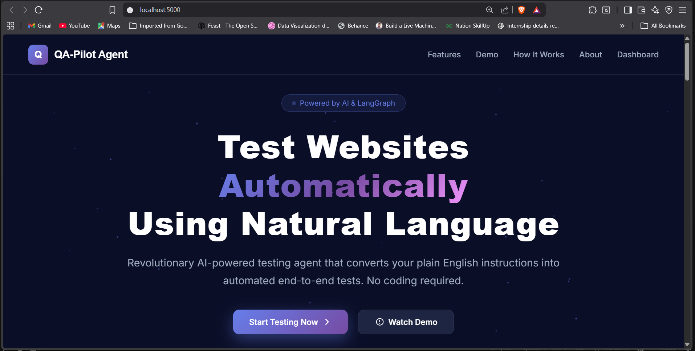

# 📸 HOW TO ADD SCREENSHOTS

## Quick Guide for Adding Professional Screenshots

### Required Screenshots (5 total)

1. **landing.png** - Home page
2. **agent-settings.png** - Agent Settings tab
3. **run-agent-results.png** - Run Agent tab with results
4. **recordings.png** - Recordings tab
5. **analyzer.png** - Analyzer tab

---

## Step-by-Step Instructions

### 1. Start Your Application
```bash
python app.py
```

### 2. Open Browser
Go to: `http://localhost:5000`

### 3. Take Each Screenshot

#### Screenshot 1: Landing Page
- URL: `http://localhost:5000`
- Capture: Full hero section with "Test Websites Automatically"
- Save as: `screenshots/landing.png`

#### Screenshot 2: Agent Settings Tab
- Go to Dashboard
- Make sure "Agent Settings" tab is active (purple highlight)
- Show the form with example filled:
  - Task: "go to youtube.com and search for 'AI tutorial'"
  - Browser: Google Chrome
  - Mode: Visible
  - Recording: Off
- Save as: `screenshots/agent-settings.png`

#### Screenshot 3: Run Agent Results
- Click "Run Agent" button
- Wait for test to complete
- Should auto-switch to "Run Agent" tab
- Capture showing:
  - ✅ Test Passed status
  - Execution Steps (Step 1: NAVIGATE, Step 2: SEARCH)
  - Generated Playwright Code section
- Save as: `screenshots/run-agent-results.png`

#### Screenshot 4: Recordings Tab
- Click "Recordings" tab
- Show recorded sessions list
- Save as: `screenshots/recordings.png`

#### Screenshot 5: Analyzer Tab
- Click "Analyzer" tab
- Show the report generation buttons and available reports
- Save as: `screenshots/analyzer.png`

---

## Screenshot Tool Recommendations

### Windows
- **Snipping Tool** (Win + Shift + S)
- **Greenshot** (Free)
- **ShareX** (Free, powerful)

### Browser Extensions
- **Awesome Screenshot**
- **Full Page Screen Capture**

### Professional Tools
- **Snagit** (Paid, best quality)
- **Lightshot** (Free)

---

## Best Practices

✅ **DO:**
- Use 1920x1080 resolution
- Zoom at 100%
- Dark mode enabled
- Clear, readable text
- Show complete UI sections
- Use PNG format for crisp quality

❌ **DON'T:**
- Include personal information
- Show incomplete page loads
- Have browser dev tools open
- Use low resolution
- Compress too much

---

## Quick Command to Check Screenshots

After adding screenshots, run:
```bash
dir screenshots\*.png
```

You should see:
- landing.png
- agent-settings.png  
- run-agent-results.png
- recordings.png
- analyzer.png

---

## Viewing in README

Once you add the screenshots, they will automatically display in:
- **README.md** - Main documentation
- GitHub repository preview
- Any markdown viewer

The images are linked as:
```markdown

```

---

**Ready to make your README look amazing! 🎨**
